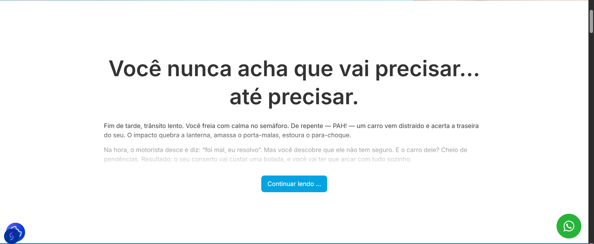

# bloco_leia_mais (WordPress shortcode)

Um shortcode leve para WordPress que cria um bloco “**Leia mais**” com título, texto colapsado/expansível e botão cuja **cor é herdada da taxonomia** do post (via term meta `cor`).  
Sem dependências de jQuery. Tipografia com **Inter** (Google Fonts).

---

## O que ele faz

- Renderiza um cartão com:
  - **Título** (meta `titulo_texto`)
  - **Conteúdo** (meta `texto`)
  - **Botão** “Continuar lendo … / Mostrar menos”
- Aplica **máscara de fade** quando o texto está fechado.
- Define a **cor do botão** automaticamente a partir do **termo da taxonomia** (meta de termo `cor`), com estas regras:
  1. Se houver **um** único termo → usa ele.
  2. Se houver **vários** termos → prioriza `para-sua-empresa`, depois `para-voce`.
  3. Se nada for encontrado → usa o primeiro termo que tenha meta `cor`.
  4. Se ainda assim não houver cor válida → usa o **fallback** `#05A3E1`.
- Aceita `#hex`, `rgb/rgba`, `hsl/hsla`.

---

## Exemplo de uso




---

## Requisitos

- WordPress 5.8+  
- PHP 7.4+ (compatível com versões mais novas)  
- Taxonomia (por padrão, `para`) com termos que possuam **meta de cor** (`cor`).  
- Nos posts: duas metas de post:  
  - `titulo_texto` (string)  
  - `texto` (HTML/Texto)

> Dica: a meta de termo `cor` pode ser criada com ACF (campo de cor) ou via `register_term_meta`.

---

## Instalação

1. Baixe este repositório (ou gere o ZIP no GitHub em **Code > Download ZIP**).
2. No WordPress, vá em **Plugins > Adicionar novo > Enviar plugin**.
3. Selecione o arquivo ZIP e clique em **Instalar agora**.
4. Ative o plugin.

> O arquivo PHP já possui **cabeçalho de plugin** — não é necessário editar nada antes de instalar.

---

## Uso

### Shortcode básico
```text
[bloco_leia_mais]
```

### Com taxonomia customizada
```text
[bloco_leia_mais tax="para"]
```

#### O shortcode busca:
- `titulo_texto` → exibido como `<h2>`
- `texto` → corpo do bloco
- Termos do post na taxonomia informada em `tax` (padrão: `para`)
  - Meta do termo **`cor`** define o `background-color` do botão.

---

## Como configurar a cor por termo

1. Vá em **Posts > Taxonomia (`para`) > Termos**.  
2. Edite o termo (ex.: `para-voce` ou `para-sua-empresa`).  
3. Adicione/edite a **meta de termo** `cor` (ex.: `#0ea5e9`, `rgb(5,163,225)`, `hsl(200 80% 45%)`).  
4. Salve.

> O código aceita tanto `#fff/#ffffff` quanto `rgb()/rgba()` e `hsl()/hsla()`.

---

## Estilos e personalização

O HTML já vem com estilos inline mínimos e um **fade** suave no texto fechado.  
Você pode ajustar via CSS global do tema:

```css
/* Aumentar a altura "fechada" (fade) de todos os blocos */
.leia-mais-container .leia-mais-texto { --fade-height: 10em; }

/* Ajustar bordas/padding do cartão */
.leia-mais-container{
  border-radius: 20px;
  padding: 1.5rem;
}

/* Forçar um tamanho de título por padrão */
.leia-mais-container .leia-mais-titulo{
  font-size: clamp(1.5rem, 2.5vw, 3rem);
}
```

> Cada instância recebe um **ID único** (`lm-POSTID-XXXX`). Você também pode mirar nele via CSS se quiser customizar **apenas um** bloco específico.

---

## Acessibilidade e UX

- O botão alterna rótulos **“Continuar lendo …”** ↔ **“Mostrar menos”**.
- Se o conteúdo for curto, o bloco **não mostra** o botão.
- Animação de altura utiliza `transition:max-height` e respeita **`prefers-reduced-motion`**.

> Para alterar os rótulos do botão, edite as strings no `<script>` do shortcode (`btn.innerText = '...'`).

---

## Adaptação para outros projetos

O código é modular e pode ser facilmente adaptado para:
- **Outros tipos de conteúdo** (produtos, eventos, portfólios).
- **Outras taxonomias** (categorias, tags personalizadas).
- **Campos personalizados** (ACF, Metabox, etc.).
- Alterar o **estilo e animação** para se integrar ao design do seu site.
- Ser integrado em **templates de tema** ou **widgets Elementor**.

> Basta alterar as chamadas de `get_post_meta`, `get_the_terms` e `get_term_meta` para atender à sua estrutura de dados.

---

## Solução de problemas

**O botão não aparece**  
- O texto pode estar curto. Adicione mais conteúdo para testar.

**A cor do botão não muda**  
- Verifique se o post está vinculado a um termo na taxonomia informada em `tax` e se esse termo tem a meta `cor`.

**Fonte Inter duplicada**  
- Se o tema já carrega Inter, remova o `wp_enqueue_style('inter-font', ...)`.

---